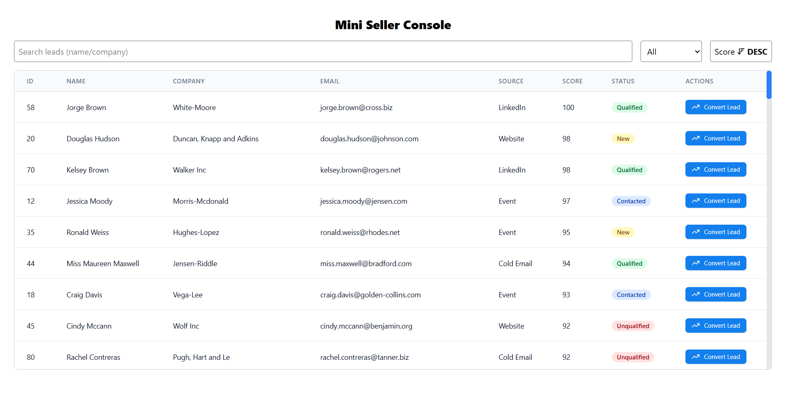

# Mini Seller Console

A compact, responsive web application designed to display and manage sales leads. This project serves as a demonstration of a modern React frontend stack.



---

## ✨ Features

- **Lead Visualization:** View a list of sales leads in a clean, sortable table.
- **Responsive Design:** The application is fully responsive and works seamlessly on desktop, tablet, and mobile devices.
- **Search & Filter:**
  - Dynamically search for leads by name or company.
  - Filter the lead list by their current status.
- **Sort by Score:** Sort leads by their score in ascending or descending order.
- **Lead Details Panel:** Click on any lead to open a side panel with detailed information.
- **Lead Conversion:** "Convert" a lead into an opportunity through an interactive modal.
- **Create Opportunities:** A form within the modal allows for the creation of new opportunities associated with a lead.

---

## 🛠️ Tech Stack

This project is built with a modern frontend toolchain:

- **Framework:** [React](https://react.dev/) (`v19`)
- **Build Tool:** [Vite](https://vitejs.dev/)
- **Language:** [TypeScript](https://www.typescriptlang.org/)
- **Styling:** [Tailwind CSS](https://tailwindcss.com/) (`v4`)
- **Icons:** [Lucide React](https://lucide.dev/)
- **Linting:** [ESLint](https://eslint.org/)

---

## 🚀 Getting Started

Follow these instructions to get a copy of the project up and running on your local machine for development and testing purposes.

### Prerequisites

You need to have [Node.js](https://nodejs.org/) (version 18 or later is recommended) and [npm](https://www.npmjs.com/) installed on your machine.

### Installation & Setup

1.  **Clone the repository:**

    ```sh
    git clone https://your-repository-link.com/mini_seller_console.git
    cd mini_seller_console
    ```

2.  **Install dependencies:**
    All the necessary dependencies are listed in the `package.json` file. Install them with:
    ```sh
    npm install
    ```

### Available Scripts

- **To run the development server:**
  This will start a local server, typically at `http://localhost:5173`, with hot-reloading enabled.

  ```sh
  npm run dev
  ```

- **To build the application for production:**
  This will compile the TypeScript code and bundle the application into a `dist` folder, ready for deployment.

  ```sh
  npm run build
  ```

- **To preview the production build:**
  This command starts a local server to serve the files from the `dist` folder.

  ```sh
  npm run preview
  ```

- **To run the linter:**
  This will analyze the code for potential errors and style issues.
  ```sh
  npm run lint
  ```
